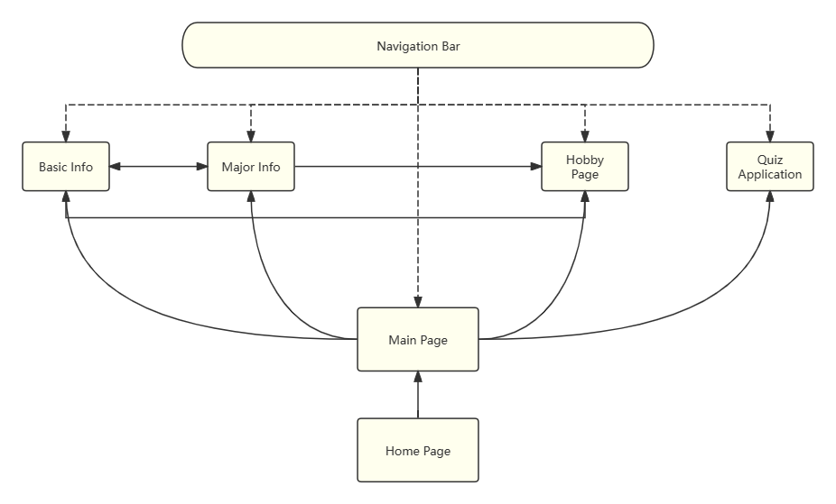
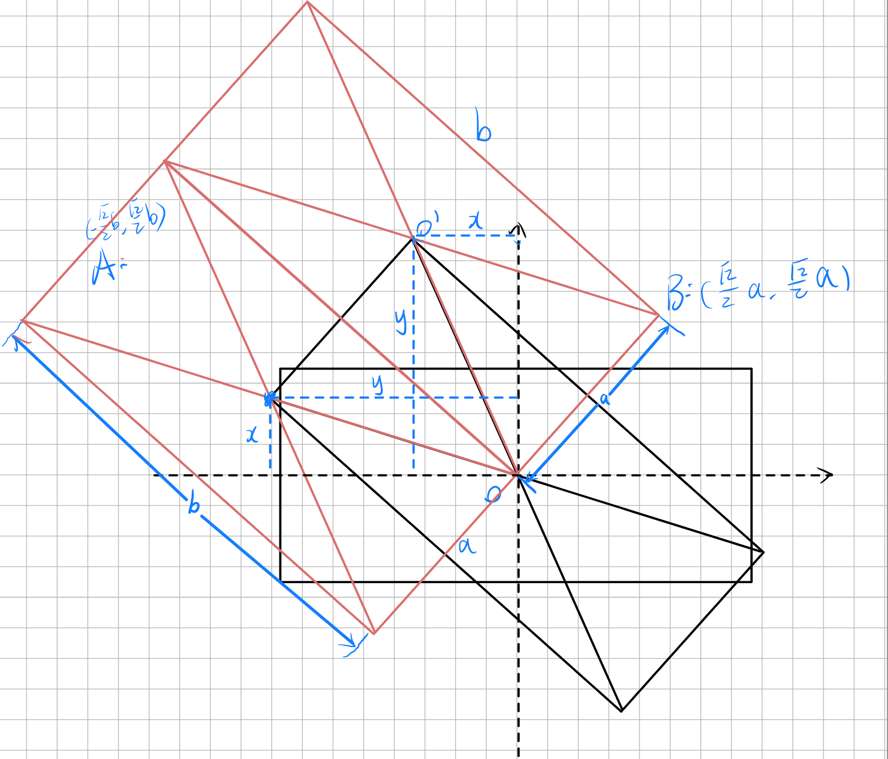

# Web Application Assignment

- **Name:** Sun Rong
- **Major:** Artificial Intelligence
- **Student ID:** 50087363
- **GitHub:** [Sun Rong's GitHub](https://github.com/GarlicToT/Web_Assignment)

# Quickstart
## Option 1: Running Directly on Codio

If you are already in Codio Box, please follow the steps below:
1. Navigate to the project directory:

    ```sh
    cd Web_Assignment
    ```

2. Install the project dependencies by running the following command:

    ```sh
    npm install
    ```

3. Once the installation is complete, start the project with:

    ```sh
    npm start
    ```

4. After the project starts, you can access it using the URL provided by Codio template.

## Option 2: Cloning from GitHub and Running Locally

1. Ensure you have Node.js installed on your machine. You can download it from [Node.js](https://nodejs.org/).
2. Clone the repository to your local machine using the following command:

    ```sh
    git clone https://github.com/GarlicToT/Web_Assignment.git
    ```
3. Navigate to the project directory:

    ```sh
    cd Web_Assignment
    ```

4. Install the project dependencies:

    ```sh
    npm install
    ```

5. Start the development server:

    ```sh
    npm start
    ```

6. Open your web browser and navigate to `http://127.0.0.1:3300/` to view the project.
# Table of Contents

- [Web Application Assignment](#web-application-assignment)
- [Quickstart](#quickstart)
  - [Option 1: Running Directly on Codio](#option-1-running-directly-on-codio)
  - [Option 2: Cloning from GitHub and Running Locally](#option-2-cloning-from-github-and-running-locally)
- [Table of Contents](#table-of-contents)
- [Structure Overview](#structure-overview)
- [Basic Design](#basic-design)
  - [Overview of the website](#overview-of-the-website)
  - [Description of each page](#description-of-each-page)
    - [Home Page](#home-page)
    - [Main Page](#main-page)
    - [Basic Information Page](#basic-information-page)
    - [Major Information Page](#major-information-page)
    - [Hobby Page](#hobby-page)
    - [Quiz Application](#quiz-application)
- [Challenges](#challenges)
  - [Home page](#home-page-1)
- [Contribute](#contribute)
- [References](#references)

# Structure Overview
[(Back to top)](#table-of-contents)

## File Structure
```
  '    |-- config.js',
  '    |-- index.js',
  '    |-- package-lock.json',
  '    |-- package.json',
  '    |-- README.md',
  '    |-- router.js',
  '    |-- src',
  '        |-- data',
  '        |   |-- questions.json',
  '        |-- fonts',
  '        |   |-- COOPBL.TTF',
  '        |-- html',
  '        |   |-- basic_info.html',
  '        |   |-- hobby.html',
  '        |   |-- home_page.html',
  '        |   |-- main_page.html',
  '        |   |-- major_info.html',
  '        |   |-- quiz.html',
  '        |   |-- tabbar.html',
  '        |-- images',
  '        |   |-- background.png',
  '        |   |-- beads.jpg',
  '        |   |-- games.png',
  '        |   |-- gpt_avatar.png',
  '        |   |-- music.jpg',
  '        |   |-- my_photo.PNG',
  '        |   |-- quiz.PNG',
  '        |   |-- small_me.png',
  '        |-- scripts',
  '        |   |-- hobby.js',
  '        |   |-- major_info.js',
  '        |   |-- quiz.js',
  '        |   |-- tabbar.js',
  '        |-- style',
  '            |-- basic_info.css',
  '            |-- fonts.css',
  '            |-- hobby.css',
  '            |-- home_page.css',
  '            |-- main_page.css',
  '            |-- major_info.css',
  '            |-- quiz.css',
  '            |-- tabbar.css',
  ''
```

## Web Structure

# Basic Design
[(Back to top)](#table-of-contents)
## Overview of the website
This website mainly consists of the following pages, **home page**, **main page**, **basic information page**, **major information page**, **hobby page** and **quiz application**, all tasks required in assignment and some extra work have been completed.

## Description of each page
### Home Page
The home page is a simple welcome page, consisting of a big  welcome svg and a button to enter the main page.

### Main Page
The main page contains a tab bar and a main content area. 
On the left side of the Main Page, there is an author picture, and it will shake when hover on the picture. Hover your mouse over the About Me button below and three navigation buttons will appear: **Basic Information**, **Major Information**, and **Hobby**.
There is a picture on the right side of the Main Page. Clicking the button will take you directly to the Quiz page.


### Basic Information Page
The Basic Information Page provides a brief introduction of the author and contains buttons to major information and hobby pages. 
Click on this page and an interesting image will first appear in the lower right corner. Inside the card, which resembles a bubble box on the page, is a brief introduction of the author. There are two navigation buttons below the text, which will navigate to Major Information Page and Hobby page. Hover on these two buttons will show rainbow dynamic effect.


### Major Information Page
The Major Information Page presents the author's major information by simulating a ChatGPT-like interface. At the bottom of the page, there are buttons to the basic information and hobby pages.
To create a ChatGPT-like interface on the Major Info page, I used the following methods and code:
1. In the HTML, I created a container for displaying chat messages and added an input box with a send button.
2. Using JavaScript to dynamically generate and display chat messages:
    - Preset messages array
    - Create a function to display messages
    ```js
    function typeMessage(message, element, callback) {
        let i = 0;
        const interval = setInterval(() => {
            element.innerHTML = message.substring(0, i + 1);
            i++;
            if (i >= message.length) {
                clearInterval(interval);
                if (callback) callback();
            }
        }, 10); // Adjust typing speed here
    }
    ```
    - Create a function to send messages

With these designs, users can input a preset question and receive automated responses. This design enhances interactivity and user experience on the page.


### Hobby Page
The main part of Hobby Page is a color palette, in which four colors represent four hobbies. Each color has a corresponding icon to distinguish it. Click on each color and the color block will expand to reveal the contents inside.
In order to achieve the above effect, I carried out the following operations:
- Rotate the four color blocks to 45 degrees around each of the four corners;
- Using javascript to calculate the distance to move the four color blocks to cover the x and y axes of the palette, and then pass the variable back to CSS by :root{};
- Set the active effect on the card to rotate and spread the whole palette after clicking the color block, so that the picture and text of the color block can be displayed (the state lifted from display: none).
### Quiz Application
On the Quiz page, the user first enters the name to participate in the quiz. If the user does not enter the name and clicks the Start button, an alert will appear to remind the user to enter the name.
After the quiz starts, user will be shown the questions and a **15-second countdown**. After the user selects the correct answer, an alert window will indicate that the answer is correct, and a button will be displayed to enter the next question; If the user answers incorrectly or the countdown ends, an alert window will indicate that the answer is wrong, as well as a button for the next question.
After the user has answered 10 questions, the results page will be displayed. The results page displays **how many questions the user answered correctly**, the **replay button**, and the user's **ranking**. The ranking is based on the number of questions answered correctly and the time taken. Users can click the replay button to return to the initial screen and quiz again.

In this page, I used the idea of **componentization**, stored all questions and answers in independent json files, and read the json files iteratively to improve the reusability and maintainability of the code.
Regarding the leaderboard, I used Socket.IO on the server side to receive client requests and update, sort and return the leaderboard.


# Challenges
[(Back to top)](#table-of-contents)
## Home Page
The resource of the welcome svg is initially made by p5.js library by the author, which should wave actually. However, I researched for a long time and found it hard to handle p5.js in my project in a short time. So I can only download the svg and use it directly.
However, I found that the svg causes many errors in HTML checker, Therefore I can only use image as the background of the home page.

## Main Page
### Font stoke of welcome text
Initially I used -webkit-text-stroke for font stoke, but I found it wouldn't pass the CSS validation, so I switched to **text-shadow** for the desired effect. 
### Tabbar of About Me
In order to achieve this tabbar effect, I really changed for a long time to achieve the desired effect!
## Basic Information Page
### Chat box effect
The style of the chat box effect requires the combination of several components, really took some work, but the final result is also satisfactory.
### Image animation
Originally, I wanted to interact image on the Main Page and Basic Information Page, that is, smooth from the position of the Main Page to the position of the Basic Information Page, but I tried for a long time but still couldn't achieve it. So I ended up enlarging the image in the lower right corner instead, which was also very satisfactory.
## Major Information Page
### ChatGPT-like interface
In fact, I have already introduced a lot of things about this previously, but it has been a long time to do it. It is not easy to preset text in a chat box, although it's just an input box that doesn't have any functionality.

## Hobby Page
The preset of each color position on the palette requires a precise budget, which takes me a night.


## Quiz Application
In the previous part, I have introduced the implementation method of quiz function in detail, which is a huge challenge in itself. In addition, in order to meet the assignment requirements, I rewrote the alert method, which will pop up regardless of whether the answer is right or wrong.

# References
[(Back to top)](#table-of-contents)

1. The welcome SVG used in the home page is generated from [Yasai's website](https://wangyasai.github.io/waveFont/) 
2. Green Background generate from [MagicPattern](https://www.magicpattern.design/tools/mesh-gradients)
3. Some styles are inspired or rewrited from [Uiverse](https://uiverse.io/)
4. Icons are from [iconfont](https://www.iconfont.cn/)